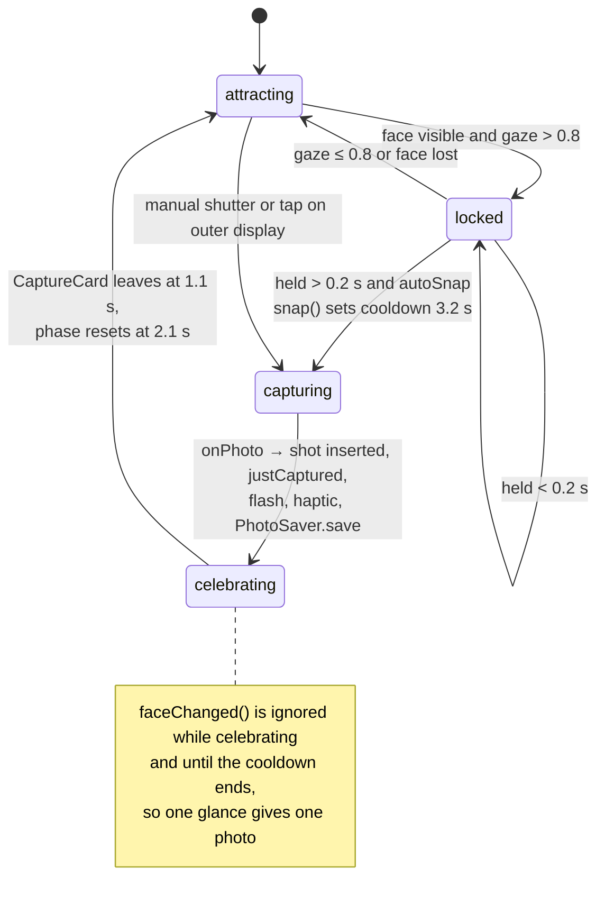
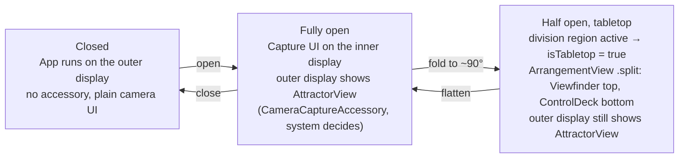
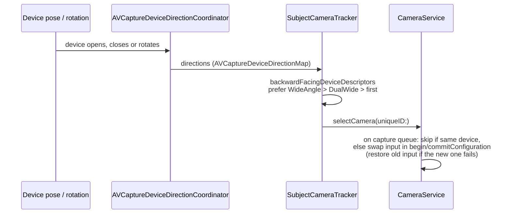
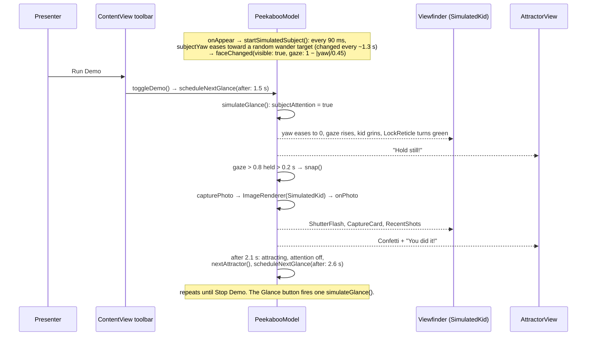

# Peekaboo: Architecture

Bitrig Hacks: iPhone Duo Edition.

## 1. Summary

Peekaboo is a camera for photographing kids and pets, who rarely look at the lens. On iPhone Duo the outer display sits on the back, facing the same way as the rear camera, so Peekaboo plays an animated **attractor** there, just under the lens. The photographer still sees the full viewfinder on the inner display, with a live mirror of what the kid sees. Vision reads the subject's face yaw and pitch. When they look straight at the lens for 0.2 s, the shutter fires on its own: the viewfinder flashes, the photo drops in as a print, and it is saved to the photo library. Meanwhile the outer display bursts confetti from the lens and shows "You did it!" as a reward. When the phone is half folded on a table (tabletop pose), the app splits across the fold: viewfinder on top, control deck below, so it works hands-free. In Simulator, a cartoon kid run by a demo director goes through the same pipeline, so the full loop runs live on stage.

**Why only iPhone Duo:** a regular iPhone has no screen facing the subject, which leaves nothing to draw their eyes to the lens and no way to reward them. Duo adds a subject-facing display (`CameraCaptureAccessory`), a physical fold that splits the layout (`ArrangementView`, `reservedRegions(kind: .division)`), and cameras whose direction changes with the pose (`AVCaptureDeviceDirectionCoordinator`). Peekaboo relies on all three.

## 2. Architecture

```mermaid
flowchart TB
    App[PeekabooApp<br/>WindowGroup, @State model] --> CV

    subgraph Inner["Inner display: capture UI"]
        CV[ContentView<br/>NavigationStack, toolbar, Run Demo, Gallery sheet]
        CV --> DA[DuoArrangement<br/>ArrangementView .split / fallback stacks]
        DA --> VF[Viewfinder<br/>LockReticle, ShutterFlash, CaptureCard,<br/>status bar, GazeMeter, outer-display mirror]
        DA --> CD[ControlDeck<br/>AttractorChip, ShutterButton, Glance, RecentShots]
        CV -. onFoldChange .-> Fold[Fold detection<br/>reservedRegions kind: .division]
        VF --> CP[CameraPreview<br/>PreviewView + AVCaptureVideoPreviewLayer]
        VF --> SK[SimulatedKid<br/>Simulator only]
    end

    subgraph Outer["Outer display: scene accessory"]
        AV[AttractorView<br/>LensBeacon, attractors, CelebrationView + Confetti]
    end

    VF -- "subjectDisplay() → sceneAccessory +<br/>CameraCaptureAccessory" --> AV

    M[(PeekabooModel<br/>@Observable shared state<br/>phase, attractor, gaze, shots, justCaptured,<br/>isTabletop, subjectYaw, demoRunning)]
    CV & VF & CD & AV <--> M
    Fold -- isTabletop --> M
    M -- save --> PS[PhotoSaver<br/>PHPhotoLibrary .addOnly]

    subgraph Cam["CameraService"]
        S[AVCaptureSession]
        PO[AVCapturePhotoOutput] --> S
        VO[AVCaptureVideoDataOutput] --> S
        VO --> VN[Vision<br/>VNDetectFaceRectanglesRequest rev 3]
    end

    M -- owns --> Cam
    VN -- "onFace(visible, gaze)" --> M
    PO -- "onPhoto(UIImage)" --> M
    CP --> T[SubjectCameraTracker<br/>AVCaptureDeviceDirectionCoordinator]
    T -- "selectCamera(uniqueID:)" --> S
```

Both displays read the same `PeekabooModel` instance, so no messages are passed between them. A tap on the outer display calls `model.snap()`, and the inner UI updates through observation.

## 3. Modules

| File | Responsibility |
|---|---|
| `PeekabooApp.swift` | App entry point. Owns the single `PeekabooModel` and hosts `ContentView` in a `WindowGroup`. |
| `PeekabooModel.swift` | `@Observable` shared state: `Attractor`, `StagePhase` (attracting / locked / celebrating), `Shot`. Runs the capture state machine (`faceChanged`, `snap`, 3.2 s cooldown, `photoArrived` → `justCaptured` + `PhotoSaver.save`). Holds the Simulator **demo director**: `startSimulatedSubject` (a 90 ms loop that moves `subjectYaw` and calls `faceChanged`), `simulateGlance`, `toggleDemo`, `scheduleNextGlance`, `nextAttractor`. |
| `CameraService.swift` | `AVCaptureSession` with a photo output and a video data output. Runs Vision at about 10 fps to compute the gaze score, swaps the camera input via `selectCamera(uniqueID:)`, and in Simulator renders `SimulatedKid` as the "photo". |
| `CameraPreview.swift` | `CameraPreview` (UIViewRepresentable over `PreviewView`) and `SubjectCameraTracker`, which wraps `AVCaptureDeviceDirectionCoordinator` and follows the camera that faces the subject. |
| `DuoSupport.swift` | Duo API wrappers with fallbacks: `DuoArrangement` (ArrangementView), `.subjectDisplay(...)` (sceneAccessory + CameraCaptureAccessory), `.onFoldChange` (reserved division region). |
| `ContentView.swift` | Inner UI: `ContentView` (toolbar with Next Attractor, **Run/Stop Demo** in Simulator, Photos), `Viewfinder`, `LockReticle` (brackets close in and turn green on lock), `ShutterFlash`, `CaptureCard` (the new photo shown as a print), the outer-display mirror (tap to enlarge it for the audience, long press to turn the outer display on or off), `GazeMeter`, `ControlDeck`, `AttractorChip`, `ShutterButton`, `RecentShots`, `Gallery`. |
| `AttractorView.swift` | Outer display content: `LensBeacon` (chevrons pointing at the lens), four attractors (`PeekabooFace`, `BubbleField`, `Starburst`, `WigglePuppy`), and `CelebrationView` with `Confetti` bursting from the lens edge. Tapping it takes the shot. |
| `SimulatedKid.swift` | Cartoon toddler in a room, used in Simulator. `yaw` turns the head (0 means facing the lens), and `happy` switches to a grin. |
| `PhotoSaver.swift` | Saves each shot to the photo library, asking for add-only access. |

## 4. Flows

### (a) Capture loop



`capturing` is not a `StagePhase` case. It is the time between `snap()` and the `onPhoto` callback. Gaze = `max(0, 1 − (|yaw|/0.6 + |pitch|/0.6) / 2)` on the largest face.

### (b) Device pose



`onAvailabilityChange` writes `model.outerAvailable`. The inner mirror is labelled "Live on outer display" when that is true and "What the kid sees" when not. The outer display is an enhancement: the capture loop works without it.

### (c) Camera direction change



At startup the session begins on the back `.builtInWideAngleCamera`. The coordinator, kept alive by `PreviewView.directionObserver`, corrects the choice after that.

### (d) Simulator demo (demo director)



The cartoon kid feeds the same `faceChanged()` path as Vision, so the demo exercises the real state machine.

## 5. iPhone Duo APIs

All are guarded by `#if compiler(>=6.4)` and `#available(iOS 27.1, *)`, each with a plain fallback.

| API | Where | What it does for the user |
|---|---|---|
| `.sceneAccessory { CameraCaptureAccessory(isEnabled:) { … }.onAvailabilityChange }` | `DuoSupport.swift` `subjectDisplay`, used in `Viewfinder` | Shows the attractor and the celebration to the kid on the outer display while the photographer frames the shot inside. Fallback: none shown. |
| `ArrangementView { } secondary: { }` + `.arrangementViewStyle(.split)` | `DuoSupport.swift` `DuoArrangement` | Puts the viewfinder on one side of the fold and the controls on the other. Fallback: `ViewThatFits` HStack/VStack. |
| `GeometryProxy.reservedRegions(kind: .division)` (`isActive`, `frame`) | `DuoSupport.swift` `onFoldChange` | Detects the half-open tabletop pose and shows the "Tabletop" badge. Fallback: never divided. |
| `AVCaptureDeviceDirectionCoordinator(view:deviceTypes:)` + `backwardFacingDeviceDescriptors` | `CameraPreview.swift` `SubjectCameraTracker` | Always shoots from the camera facing the subject, whatever the fold state or rotation. Fallback: back wide camera. |
| Device types `.builtInOuterUltraWideCamera`, `.builtInInnerUltraWideCamera` | `SubjectCameraTracker` | Includes the Duo-specific cameras when choosing the subject-facing one. |

Not Duo-specific: Vision `VNDetectFaceRectanglesRequest` revision 3 (yaw/pitch), `AVCapturePhotoOutput`, `PHPhotoLibrary`, and `glassEffect` for the status capsule.

## 6. Build and run

```sh
cd peekaboo-duo
xcodegen generate            # project.yml → Peekaboo.xcodeproj
open Peekaboo.xcodeproj      # build and run scheme "Peekaboo"
```

- **Duo features:** Xcode 27.1 beta (iOS 27.1 SDK, Swift compiler 6.4 or later), on an iPhone Duo simulator or device.
- **Xcode 26:** builds with the fallbacks (single display, stacked layout, back wide camera). The deployment target is iOS 26.0.
- **Simulator:** there is no camera. `SimulatedKid` stands in for the subject. Use **Run Demo** in the toolbar for the automatic loop, or **Glance** for a single look.
- **Device:** asks for camera access and add-only photo library access. Shots are saved to Photos and also shown in RecentShots and the Gallery sheet.

## 7. 60-second demo script

| Time | Action | Say |
|---|---|---|
| 0:00 | Hold up the Duo, inner display toward the judges. | "Every parent has 400 photos of the side of their kid's head. Peekaboo fixes that with the screen Duo puts on the back." |
| 0:08 | Viewfinder shows the kid looking away (in Simulator, the cartoon kid wanders). Status: "Waiting for a look", white brackets. | "Here's our subject, looking anywhere but the camera." |
| 0:15 | Tap the outer-display mirror to enlarge it, or flip the phone to show the back. | "The back display faces them and plays a peekaboo right under the lens. The arrows point straight at it." |
| 0:25 | Tap **Run Demo** in Simulator, or switch the attractor to Puppy on a device. | "Puppy, bubbles, sparkles: whatever works on your kid or your dog." |
| 0:30 | The kid turns to the lens and grins. The gaze meter and brackets turn green, the shutter fills green. | "Vision reads where their face points. The moment they look at the lens..." |
| 0:36 | Flash, the print drops in, and the mirror shows confetti and "You did it!". | "...it takes the photo, saves it, and the back display throws confetti for them." |
| 0:42 | The demo loops with the next attractor. Fold to about 90° and stand it on the table: "Tabletop" badge, split layout. | "Stand it on the table: viewfinder on top, controls below the fold, no hands needed." |
| 0:52 | Point at RecentShots filling up. | "Peekaboo: the only camera that makes kids look at it, and only on iPhone Duo." |
