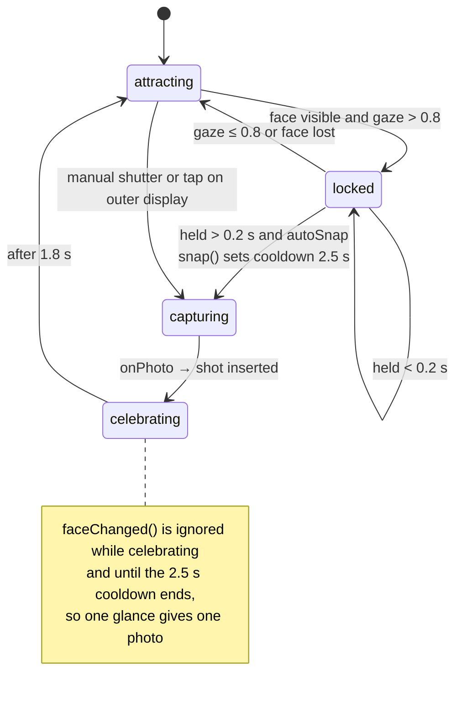
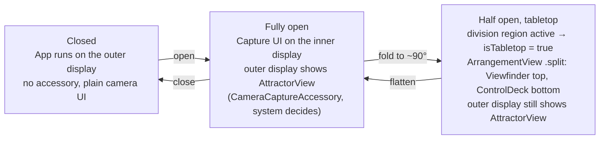
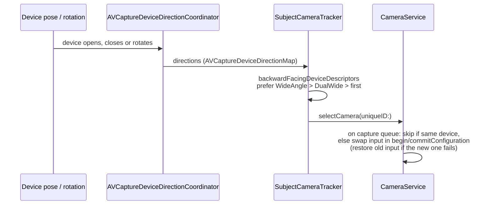
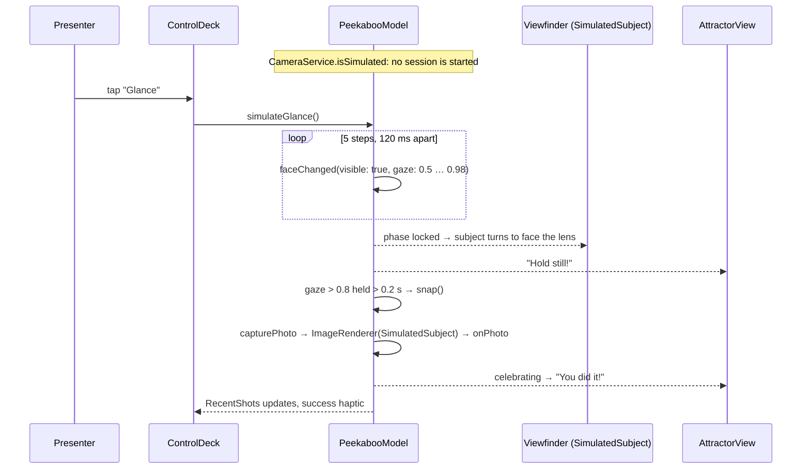

# Peekaboo: Architecture

Bitrig Hacks: iPhone Duo Edition.

## 1. Summary

Peekaboo is a camera for photographing kids and pets, who rarely look at the lens. On iPhone Duo the outer display sits on the back, facing the same way as the rear camera, so Peekaboo plays an animated **attractor** there, just under the lens. The photographer still sees the full viewfinder on the inner display. Vision reads the subject's face yaw and pitch. When they look straight at the lens for 0.2 s, the shutter fires on its own, and the outer display celebrates ("You did it!") as a reward. When the phone is half folded on a table (tabletop pose), the app splits across the fold: viewfinder on top, control deck below, so it works hands-free.

**Why only iPhone Duo:** a regular iPhone has no screen facing the subject, which leaves nothing to draw their eyes to the lens and no way to reward them. Duo adds a subject-facing display (`CameraCaptureAccessory`), a physical fold that splits the layout (`ArrangementView`, `reservedRegions(kind: .division)`), and cameras whose direction changes with the pose (`AVCaptureDeviceDirectionCoordinator`). Peekaboo relies on all three.

## 2. Architecture

```mermaid
flowchart TB
    App[PeekabooApp<br/>WindowGroup, @State model] --> CV

    subgraph Inner["Inner display: capture UI"]
        CV[ContentView<br/>NavigationStack, toolbar, Gallery sheet]
        CV --> DA[DuoArrangement<br/>ArrangementView .split / fallback stacks]
        DA --> VF[Viewfinder<br/>status bar, GazeMeter, subject preview]
        DA --> CD[ControlDeck<br/>AttractorChip, ShutterButton, RecentShots]
        CV -. onFoldChange .-> Fold[Fold detection<br/>reservedRegions kind: .division]
        VF --> CP[CameraPreview<br/>PreviewView + AVCaptureVideoPreviewLayer]
        VF --> SS[SimulatedSubject<br/>Simulator only]
    end

    subgraph Outer["Outer display: scene accessory"]
        AV[AttractorView<br/>LensBeacon, attractors, CelebrationView]
    end

    VF -- "subjectDisplay() → sceneAccessory +<br/>CameraCaptureAccessory" --> AV

    M[(PeekabooModel<br/>@Observable shared state<br/>phase, attractor, gaze, shots, isTabletop)]
    CV & VF & CD & AV <--> M
    Fold -- isTabletop --> M

    subgraph Cam["CameraService"]
        S[AVCaptureSession]
        PO[AVCapturePhotoOutput] --> S
        VO[AVCaptureVideoDataOutput] --> S
        VO --> VN[Vision<br/>VNDetectFaceRectanglesRequest rev 3]
    end

    M -- owns --> Cam
    VN -- "onFace(visible, gaze)" --> M
    PO -- "onPhoto(UIImage)" --> M
    CP --> T[SubjectCameraTracker<br/>AVCaptureDeviceDirectionCoordinator]
    T -- "selectCamera(uniqueID:)" --> S
```

Both displays read the same `PeekabooModel` instance, so no messages are passed between them. A tap on the outer display calls `model.snap()`, and the inner UI updates through observation.

## 3. Modules

| File | Responsibility |
|---|---|
| `PeekabooApp.swift` | App entry point. Owns the single `PeekabooModel` and hosts `ContentView` in a `WindowGroup`. |
| `PeekabooModel.swift` | `@Observable` shared state: `Attractor` enum, `StagePhase` (attracting / locked / celebrating), `Shot`, and the capture state machine (`faceChanged`, `snap`, cooldown, `simulateGlance`, `nextAttractor`). |
| `CameraService.swift` | `AVCaptureSession` with a photo output and a video data output. Runs Vision at about 10 fps to compute the gaze score, swaps the camera input via `selectCamera(uniqueID:)`, and renders a fake photo in Simulator. Also defines `SimulatedSubject`. |
| `CameraPreview.swift` | `CameraPreview` (UIViewRepresentable over `PreviewView`) and `SubjectCameraTracker`, which wraps `AVCaptureDeviceDirectionCoordinator` and follows the camera that faces the subject. |
| `DuoSupport.swift` | Duo API wrappers with fallbacks: `DuoArrangement` (ArrangementView), `.subjectDisplay(...)` (sceneAccessory + CameraCaptureAccessory), `.onFoldChange` (reserved division region). |
| `ContentView.swift` | Inner UI: `ContentView`, `Viewfinder` (status bar, `GazeMeter`, live mini preview of the outer display), `ControlDeck`, `AttractorChip`, `ShutterButton`, `RecentShots`, `Gallery`. |
| `AttractorView.swift` | Outer display content: `LensBeacon` (chevrons pointing at the lens), four attractors (`PeekabooFace`, `BubbleField`, `Starburst`, `WigglePuppy`), `CelebrationView`. Tapping it takes the shot. |

## 4. Flows

### (a) Capture loop



`capturing` is not a `StagePhase` case. It is the time between `snap()` and the `onPhoto` callback. Gaze = `max(0, 1 − (|yaw|/0.6 + |pitch|/0.6) / 2)` on the largest face.

### (b) Device pose



`onAvailabilityChange` writes `model.outerAvailable`. The inner mini preview is labelled "Live on outer display" when that is true and "What they'll see" when not. The outer display is an enhancement: the capture loop works without it.

### (c) Camera direction change



At startup the session begins on the back `.builtInWideAngleCamera`. The coordinator, kept alive by `PreviewView.directionObserver`, corrects the choice after that.

### (d) Simulator demo



Simulated glances go through the same `faceChanged()` path as Vision, so the demo exercises the real state machine.

## 5. iPhone Duo APIs

All are guarded by `#if compiler(>=6.4)` and `#available(iOS 27.1, *)`, each with a plain fallback.

| API | Where | What it does for the user |
|---|---|---|
| `.sceneAccessory { CameraCaptureAccessory(isEnabled:) { … }.onAvailabilityChange }` | `DuoSupport.swift` `subjectDisplay`, used in `Viewfinder` | Shows the attractor and the celebration to the kid on the outer display while the photographer frames the shot inside. Fallback: none shown. |
| `ArrangementView { } secondary: { }` + `.arrangementViewStyle(.split)` | `DuoSupport.swift` `DuoArrangement` | Puts the viewfinder on one side of the fold and the controls on the other. Fallback: `ViewThatFits` HStack/VStack. |
| `GeometryProxy.reservedRegions(kind: .division)` (`isActive`, `frame`) | `DuoSupport.swift` `onFoldChange` | Detects the half-open tabletop pose and shows the "Tabletop" badge. Fallback: never divided. |
| `AVCaptureDeviceDirectionCoordinator(view:deviceTypes:)` + `backwardFacingDeviceDescriptors` | `CameraPreview.swift` `SubjectCameraTracker` | Always shoots from the camera facing the subject, whatever the fold state or rotation. Fallback: back wide camera. |
| Device types `.builtInOuterUltraWideCamera`, `.builtInInnerUltraWideCamera` | `SubjectCameraTracker` | Includes the Duo-specific cameras when choosing the subject-facing one. |

Not Duo-specific: Vision `VNDetectFaceRectanglesRequest` revision 3 (yaw/pitch), `AVCapturePhotoOutput`, and `glassEffect` for the status capsule.

## 6. Build and run

```sh
cd peekaboo-duo
xcodegen generate            # project.yml → Peekaboo.xcodeproj
open Peekaboo.xcodeproj      # build and run scheme "Peekaboo"
```

- **Duo features:** Xcode 27.1 beta (iOS 27.1 SDK, Swift compiler 6.4 or later), on an iPhone Duo simulator or device.
- **Xcode 26:** builds with the fallbacks (single display, stacked layout, back wide camera). The deployment target is iOS 26.0.
- **Simulator:** there is no camera, so `SimulatedSubject` stands in for the subject and the **Glance** button drives the loop.
- **Device:** asks for camera access (`NSCameraUsageDescription`). Photos stay in memory (`model.shots`) and are shown in the Gallery sheet.

## 7. 60-second demo script

| Time | Action | Say |
|---|---|---|
| 0:00 | Hold up the Duo, inner display toward the judges. | "Every parent has 400 photos of the side of their kid's head. Peekaboo fixes that with the screen Duo puts on the back." |
| 0:08 | Viewfinder shows the subject looking away. Status: "Waiting for a look". | "Here's our subject, not looking at the camera." |
| 0:15 | Point at the mini preview in the corner, then flip to show the outer display. | "The back display faces them and plays a peekaboo right under the lens. The arrows point straight at it." |
| 0:25 | Switch attractor (chip or wand) to Puppy. | "Puppy, bubbles, sparkles: pick whatever works on your kid or your dog." |
| 0:30 | Trigger the glance (the subject looks up, or tap **Glance** in Simulator). Gaze meter turns green, shutter fills green. | "Vision reads where their face points. The moment they look at the lens..." |
| 0:36 | The shot fires on its own and the outer display shows "You did it!". | "...it takes the photo, and the back display cheers them for it." |
| 0:42 | Fold to about 90° and stand it on the table. "Tabletop" badge appears, layout splits. | "Stand it on the table: viewfinder on top, controls below the fold, no hands needed." |
| 0:52 | Show RecentShots / Gallery. | "Peekaboo: the only camera that makes kids look at it, and only on iPhone Duo." |
