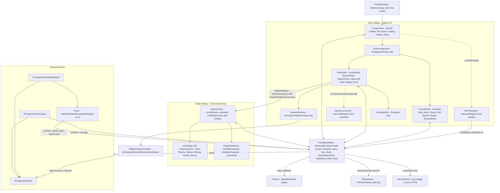
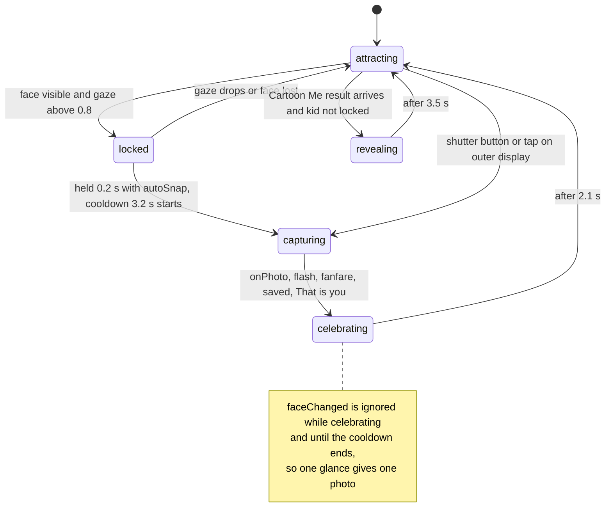
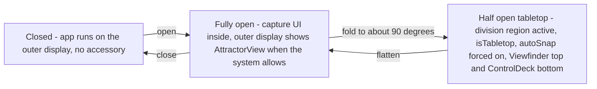
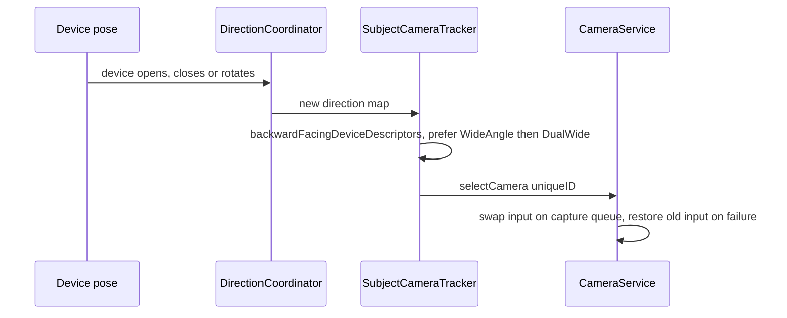
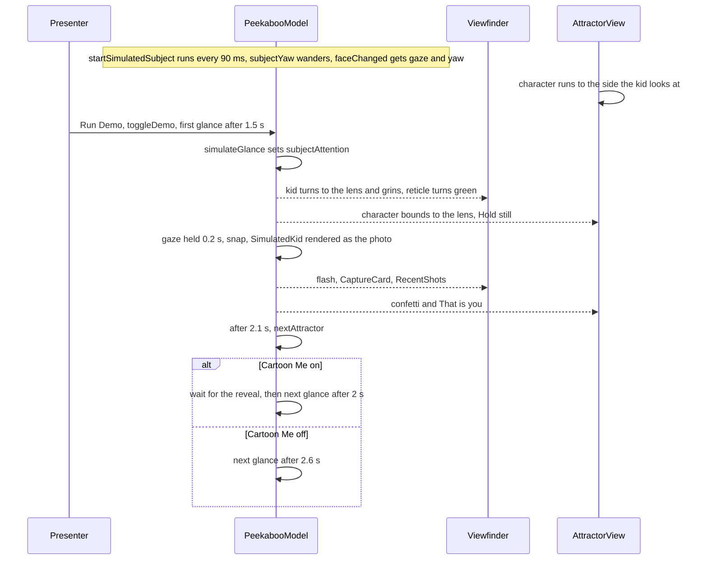
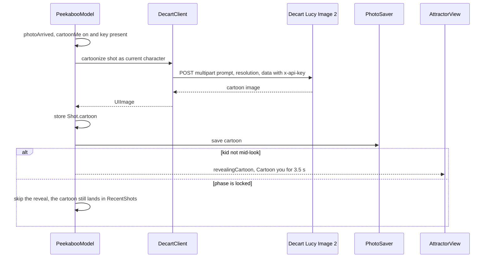

# Peekaboo: Architecture

Bitrig Hacks: iPhone Duo Edition.

## 1. Summary

Peekaboo is a camera for photographing kids and pets, who rarely look at the lens. On iPhone Duo the outer display sits on the back, facing the same way as the rear camera, so Peekaboo plays an animated **character** there, just under the lens. The character runs to whichever side the kid is looking (Vision yaw), then bounds up toward the lens. The photographer still sees the full viewfinder on the inner display, with a live mirror of what the kid sees. When the kid looks straight at the lens for 0.2 s, the shutter fires on its own: the viewfinder flashes, the photo drops in as a print, a jingle plays, and the photo is saved. The outer display bursts confetti from the lens and shows the kid their own photo ("That's you!"). With **Cartoon Me** switched on, the shot also goes to Decart's Lucy Image 2 model, and a moment later the outer display reveals the kid as a cartoon ("Cartoon you!"). When the phone is half folded on a table (tabletop pose), the app splits across the fold (viewfinder on top, control deck below) and forces auto-snap on, so it works hands-free. In Simulator, a cartoon kid run by a demo director goes through the same pipeline, so the full loop runs live on stage. The app is **iPhone Duo only**: the deployment target is iOS 27.1.

**Why only iPhone Duo:** a regular iPhone has no screen facing the subject, which leaves nothing to draw their eyes to the lens and no way to reward them. Duo adds a subject-facing display (`CameraCaptureAccessory`), a physical fold that splits the layout (`ArrangementView`, `reservedRegions(kind: .division)`), and cameras whose direction changes with the pose (`AVCaptureDeviceDirectionCoordinator`). Peekaboo relies on all three, plus Duo's vertical toolbars and camera occlusion regions.

## 2. Architecture



Both displays read the same `PeekabooModel` instance, so no messages are passed between them. A tap on the outer display calls `model.snap()`, and the inner UI updates through observation.

## 3. Modules

| File | Responsibility |
|---|---|
| `PeekabooApp.swift` | App entry point. Owns the single `PeekabooModel` and hosts `ContentView`. |
| `PeekabooModel.swift` | `@Observable` shared state: `Attractor` (9 characters, with tint, SF Symbol and Lottie `animationName`), `StagePhase`, `Shot` (`image`, optional `cartoon`). Runs the capture state machine (`faceChanged`, `snap`, 3.2 s cooldown, `photoArrived`). Derives `lure` (-1 / 0 / 1 from the sign of yaw, with a dead zone of 0.2) and `cartoonize(_:)` (Cartoon Me, `revealingCartoon`). Holds the Simulator **demo director** (`startSimulatedSubject`, `simulateGlance`, `toggleDemo`, `scheduleNextGlance`) and `startCalling` (a jingle every 4 s). |
| `CameraService.swift` | `AVCaptureSession` with photo and video data outputs. Runs Vision at about 10 fps and reports gaze plus signed yaw, swaps the input via `selectCamera(uniqueID:)`, and in Simulator renders `SimulatedKid` as the photo. |
| `CameraPreview.swift` | `CameraPreview` (`PreviewView`) and `SubjectCameraTracker` (direction coordinator that follows the camera facing the subject). |
| `DuoSupport.swift` | Duo API wrappers: `DuoArrangement`, `.subjectDisplay(...)`, `.onFoldChange` (division region), `.onCameraOcclusionChange` (occlusion region clearance). |
| `ContentView.swift` | Inner UI: toolbar, `Viewfinder` (background extension, occlusion-aware status pill, `LockReticle`, `ShutterFlash`, `CaptureCard`, a mirror of the outer display that enlarges on tap and turns the outer display on or off on long press), `ControlDeck` (Auto, **Cartoon Me** shown only when a Decart key exists, Sound, shutter, Glance in Simulator), `RecentShots` and `Gallery` (these show the cartoon when one exists). |
| `AttractorView.swift` | Outer display: `LensBeacon`, the current character, and `CelebrationView` (`Confetti` plus the photo as a print, titled "That's you!" or "Cartoon you!"). Defines `LottieCharacter` and `LureStage` (moves a Lottie character to the `lure` side, then hops it toward the lens). Tapping it takes the shot. |
| `PuppyCharacter.swift` | Pip, a procedural puppy that runs into the kid's line of sight and jump-spins when they lock. |
| `SparkleCharacters.swift` | `TwinkleCharacter` and `BubblesCharacter`: procedural Canvas characters driven by `SpkClock`, which eases `lure`. |
| `CharacterJSON/` | Lottie files: `coucou` (Peekaboo Bear), `pikachu`, `minion`, `mickey`, `panda`, `bunny`. They play through the `lottie-spm` package (see `project.yml`). |
| `DecartClient.swift` | Sends a multipart `POST https://api.decart.ai/v1/generate/lucy-image-2` (prompt built from the current character, 480p, JPEG downscaled to 1024 px) with the `x-api-key` header. The key is read from the bundled `DecartKey.txt`. |
| `DecartKey.txt` | Decart API key. **Git-ignored.** If it is missing, Cartoon Me is hidden and the app makes no network calls. |
| `SimulatedKid.swift` | Cartoon toddler for Simulator: `yaw` turns the head, `happy` shows a grin. |
| `PhotoSaver.swift` | Saves shots and cartoons to Photos, asking for add-only access. |
| `Chimes.swift` | `AVAudioEngine` synth: a jingle for each character and a fanfare on capture. Controlled by `soundOn`. |

## 4. Flows

### (a) Capture loop



`capturing` and `revealing` are not `StagePhase` cases. `capturing` is the time between `snap()` and `onPhoto`. `revealing` is `phase == .celebrating` with `revealingCartoon == true`, and it sets a 4 s cooldown. Gaze = `max(0, 1 − (|yaw|/0.6 + |pitch|/0.6) / 2)` on the largest face. `lure` updates on every frame, even during cooldown, so the characters keep chasing the kid's gaze.

### (b) Device pose



`onAvailabilityChange` writes `model.outerAvailable`. The inner mirror is labelled "Live on outer display" when that is true and "What the kid sees" when not. The outer display is an enhancement: the capture loop works without it.

### (c) Camera direction change



At startup the session begins on the back `.builtInWideAngleCamera`. The coordinator, kept alive by `PreviewView.directionObserver`, corrects the choice after that.

### (d) Simulator demo



The simulated kid feeds the same `faceChanged()` path as Vision, so the demo exercises the real state machine. The Glance button triggers a single `simulateGlance()`.

### (e) Cartoon Me



Failures are silent (`try?`), so the normal photo is never lost.

## 5. iPhone Duo APIs

The app targets iOS 27.1, so these always run. The `#if compiler(>=6.4)` / `#available(iOS 27.1, *)` guards in `DuoSupport.swift` / `CameraPreview.swift` remain only as compile guards.

| API | Where | What it does for the user |
|---|---|---|
| `.sceneAccessory { CameraCaptureAccessory(isEnabled:) { … }.onAvailabilityChange }` | `DuoSupport.swift` `subjectDisplay`, used in `Viewfinder` | Shows the character, the celebration and the cartoon reveal to the kid on the outer display while the photographer frames the shot inside. |
| `ArrangementView { } secondary: { }` + `.arrangementViewStyle(.split)` | `DuoArrangement` | Puts the viewfinder on one side of the fold and the controls on the other. |
| `GeometryProxy.reservedRegions(kind: .division)` | `onFoldChange` | Detects the tabletop pose, shows "Tabletop · hands-free" and forces auto-snap on. |
| `reservedRegions(kind: .occlusion)` | `onCameraOcclusionChange` in `Viewfinder` | Pushes the status pill below an active camera. |
| `AVCaptureDeviceDirectionCoordinator(view:deviceTypes:)` + `backwardFacingDeviceDescriptors` | `SubjectCameraTracker` | Always shoots from the camera facing the subject, whatever the fold state or rotation. |
| Device types `.builtInOuterUltraWideCamera`, `.builtInInnerUltraWideCamera` | `SubjectCameraTracker` | Includes the Duo-specific cameras when choosing the subject-facing one. |
| `ToolbarItemPlacement.topBarPinnedTrailing` + `.visibilityPriority(.high)` | Toolbar: Next Attractor pinned; Run Demo is `.primaryAction` with high priority | Keeps the key actions visible on vertical bars. Photos is `.secondaryAction`, so it moves to the overflow menu. |
| `.backgroundExtensionEffect()` | `Viewfinder` picture layer | The picture continues under a vertical bar. |
| `.presentationPlacement(.trailing)` + `.presentationDetents([.medium, .large])` | Gallery sheet | Photos open beside the viewfinder, so the shot stays in view. |

Not Duo-specific: Vision face rectangles rev 3, `AVCapturePhotoOutput`, `PHPhotoLibrary`, `AVAudioEngine`, Lottie, and the Decart HTTP API.

## 6. Build and run

```sh
cd peekaboo-duo
export DEVELOPER_DIR=/Applications/Xcode-beta.app/Contents/Developer
echo "<decart key>" > Peekaboo/DecartKey.txt   # optional, enables Cartoon Me (git-ignored)
xcodegen generate            # project.yml → Peekaboo.xcodeproj (resolves lottie-spm)
xcodebuild -scheme Peekaboo -destination 'platform=iOS Simulator,name=<iPhone Duo simulator>' build
```

- **Required:** Xcode 27.1 beta (iOS 27.1 SDK, Swift 6.4 compiler). The app is iPhone Duo only, with a deployment target of iOS 27.1. Xcode 26 is not supported.
- **Simulator:** `SimulatedKid` stands in for the camera. Use **Run Demo** for the automatic loop, or **Glance** for a single look.
- **Device:** asks for camera access and add-only photo library access. Cartoon Me needs network access and `DecartKey.txt` at build time.

## 7. 60-second demo script

| Time | Action | Say |
|---|---|---|
| 0:00 | Hold up the Duo, inner display toward the judges. | "Every parent has 400 photos of the side of their kid's head. Peekaboo fixes that with the screen Duo puts on the back." |
| 0:08 | Kid looks away (cartoon kid wanders in Simulator). Status "Waiting for a look". Tap the mirror to enlarge it. | "The back display faces the kid, and Pikachu runs to wherever they're looking..." |
| 0:18 | Tap **Run Demo**, or wait for a real glance. The character bounds up toward the lens. | "...then leads their eyes up to the lens." |
| 0:26 | The kid meets the lens. Reticle, gaze meter and shutter turn green. | "Vision sees the moment they look at the camera..." |
| 0:31 | Flash, the print drops in, confetti, "That's you!" on the back. | "...takes the photo, saves it, and shows the kid their own photo as a reward." |
| 0:38 | A few seconds later the back shows "Cartoon you!". | "Turn on Cartoon Me and Decart's Lucy model turns them into a cartoon, right on the back screen." |
| 0:46 | Fold to about 90° on the table: "Tabletop · hands-free", split layout. | "Stand it on the table and it shoots on a look. No hands needed." |
| 0:54 | Point at RecentShots. | "Peekaboo: the only camera that makes kids look at it, and only on iPhone Duo." |
