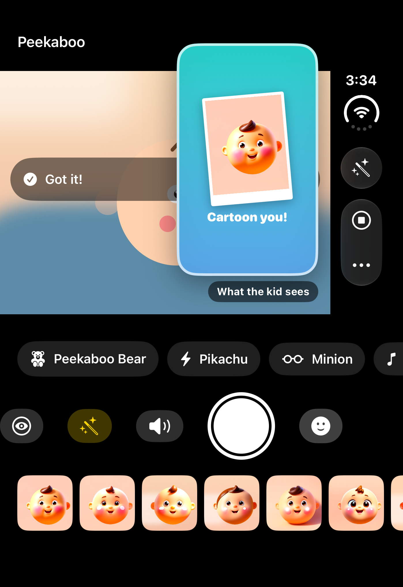
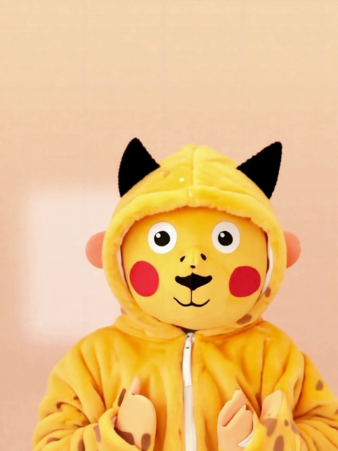
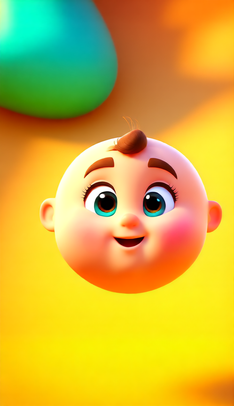
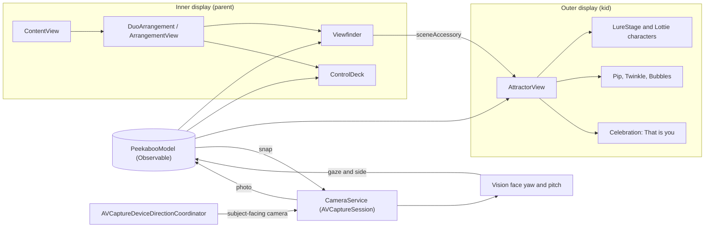

<div align="center">

# 👀 Peekaboo

### The camera that gets your kid to look at the lens.

**Built for iPhone Duo, Apple's first foldable iPhone.**
The outer display sits right beside the camera, facing your kid. Peekaboo puts a cartoon friend there, waits for the kid to look, and takes the photo on its own.

[](https://developer.apple.com/iphone-duo/)
[](#build-and-run)
[](https://swift.org)
[](#architecture)
[](#privacy)
[](https://bitrig.com)

<br/>

&nbsp;
&nbsp;


<sub>Left: Peekaboo on the iPhone Duo simulator in Bitrig, with the vertical Duo toolbar, "Cartoon you!" on the kid's screen and a strip of cartoon shots. Middle: virtual try-on. Right: Cartoon Me.</sub>

</div>

---

## The problem every parent has

Open your camera roll. Hundreds of photos of your kid, and in most of them they're looking **at you**, not at the camera.

It's not the kid's fault. On every phone until now, the screen faces the photographer and the lens faces the subject, with **nothing next to the lens for the kid to look at**. So they look at the most interesting thing in the room: your face, over the top of the phone.

Pet owners know the same pain.

## The fix: put something worth looking at next to the lens

iPhone Duo has a display on the outside, **facing the same way as the rear camera**. Peekaboo turns it into a stage:

1. **Attract.** A full-screen cartoon character (Pikachu, a Minion, Mickey, a peekaboo bear…) plays on the outer display, with a jingle, right under the lens.
2. **Follow.** On-device Vision tracks where the kid is looking. If they look away to the left, the character **runs to the left** to catch their eye, then **bounds up toward the lens**, and the kid's eyes follow it.
3. **Snap.** The moment the kid's face points straight at the lens, the shutter fires by itself. No "look here, sweetie!" needed.
4. **Reward.** The outer display bursts into confetti and shows the kid **their own photo: "That's you!"** Moments later, **"Cartoon you!"**: the same shot redrawn as a 3D cartoon by Decart. Kids love it, so they look again.

Half-fold the phone and stand it on a table, and it becomes a **hands-free tabletop camera**: the viewfinder on the top half, the controls on the bottom, auto-shutter on. The parent gets down on the floor and plays; Peekaboo takes the pictures.

> **One phone, two audiences.** The inner display is for the parent, the outer display is for the kid, and each side can affect the other. The parent picks the character; the kid's look (or tap) is the shutter; the kid sees the result.

---

## Why this only works on iPhone Duo

| On a normal iPhone | On iPhone Duo with Peekaboo |
|---|---|
| The screen faces the parent, so there's nothing for the kid to look at by the lens | The outer display faces the kid, right under the lens |
| The parent waves, shouts and makes noises from behind the phone | The character does the work, exactly where the kid should look |
| The parent guesses when to press the shutter | Vision fires when the face points at the lens |
| The kid never sees the result | The kid sees "That's you!" instantly |
| Needs a tripod or a second person | Half-fold it and stand it on the table |

---

## Features

- 🎭 **9 full-screen characters.** Ready-made Lottie animations (Peekaboo Bear, **Pikachu**, **Minion**, **Steamboat Willie Mickey**, Panda, Bunny) plus three fully procedural SwiftUI characters (**Pip** the puppy, **Twinkle** the star, **Bubbles**) with running legs, waving arms, squash and stretch, and eyes that look up at the lens.
- 🧭 **Gaze-chasing.** Characters move toward the side the kid is looking at, then lead their eyes up to the lens.
- 👁️ **Look-to-shoot.** Vision's face yaw and pitch give a 0–1 gaze score; 0.2 s of eye contact above 0.8 fires the shutter, then a cooldown stops double shots.
- 🎉 **Reward loop.** Confetti from the lens edge plus the kid's own photo as a bouncing print, with a fanfare.
- 🪄 **Cartoon Me.** Each shot is turned into a Pixar-style cartoon of the kid by [Decart](https://decart.ai)'s Lucy image model. Moments later the outer display reveals **"Cartoon you!"**, and the parent gets both versions in the gallery. It's opt-in with its own switch, as the only feature that uses the network.
- 👗 **Virtual try-on.** Pick an outfit (yellow electric-mouse onesie, goggles and overalls, big-ears outfit, superhero, princess, dinosaur) and Decart's **Lucy VTON** model dresses the kid in it. The photo becomes a 2-second clip on the device (`AVAssetWriter`), the job is submitted and polled, and the outer display loops **"Dress-up you!"**. It takes about 11 s.
- 🎨 **Cartoon Studio.** The parent directs the cartoon: pick a **style** (Pixar 3D, anime, superhero, astronaut, fairy tale, claymation, dino rider), a **costume** (Pikachu onesie, Minion overalls, Mickey outfit, superhero, princess, dinosaur), a **pose** (as taken, waving, flying, dancing, jumping, hugging the character) and add **their own prompt** ("wearing a birthday hat", "with our cat"). A live preview shows the exact instruction sent to Decart.
- 🎵 **A jingle for each character.** A tiny built-in synth (`AVAudioEngine`): *pi-ka-chu*, *ba-na-na*, *pee-ka-BOO*, *woof woof*. It repeats every 4 s while waiting for a look.
- 👆 **The kid can shoot too.** Tapping the outer display takes the photo.
- 🪞 **"What the kid sees" mirror.** A live miniature of the outer display on the parent's screen. Tap to enlarge, long-press to turn the outer display off.
- 🏕️ **Tabletop mode.** A half-fold is detected through the fold's reserved region; the layout splits across the fold and auto-shutter switches on.
- 🎯 **Lock-on reticle, shutter flash, polaroid drop and haptics** on the parent's side.
- 🖼️ **Gallery and Photos saving**, with add-only photo library access.
- 🎬 **Stage demo mode.** In the Simulator (no camera), a cartoon toddler looks around the room and the whole loop runs live: **Run Demo**, or **Glance** for a single look.

---

## iPhone Duo APIs used

Peekaboo is built on the iOS 27.1 SDK and uses these new iPhone Duo APIs:

| API | Where | What it does for the user |
|---|---|---|
| `sceneAccessory { CameraCaptureAccessory { … } }` | `DuoSupport.swift` | Shows the character on the **outer display** while the camera runs, sharing the same model as the capture interface with no message passing |
| `.onAvailabilityChange` / `isEnabled` binding | `DuoSupport.swift`, `ContentView.swift` | Knows whether the system is presenting the outer content, and lets the parent switch it off |
| `ArrangementView` + `.arrangementViewStyle(.split)` | `DuoSupport.swift` | Viewfinder and controls, split around the fold |
| `GeometryProxy.reservedRegions(kind: .division)` | `DuoSupport.swift` | Detects the half-folded pose, which switches on tabletop mode |
| `GeometryProxy.reservedRegions(kind: .occlusion)` | `DuoSupport.swift` | Keeps the status pill clear of the inner camera |
| `AVCaptureDeviceDirectionCoordinator` | `CameraPreview.swift` | Always shoots from a camera **facing the kid**, even as the phone opens, closes and rotates |
| `ToolbarItemPlacement.topBarPinnedTrailing` + `.visibilityPriority(.high)` | `ContentView.swift` | Key controls stay visible when the Duo moves bars to a **vertical side bar** |
| `.backgroundExtensionEffect()` | `ContentView.swift` | The camera picture runs under the vertical bar |
| `.presentationPlacement(.trailing)` | `ContentView.swift` | The gallery slides in from the side, keeping the viewfinder visible |

A taste of the core idea, which is the whole outer-display integration:

```swift
Viewfinder(model: model)
    .sceneAccessory {
        CameraCaptureAccessory(isEnabled: $model.outerEnabled) {
            AttractorView(model: model)          // the kid's side
        }
        .onAvailabilityChange { model.outerAvailable = $0 }
    }
```

---

## Architecture



**The capture loop** is a small state machine: `attracting → locked → celebrating → attracting`, with a 3.2 s cooldown so one look gives one photo.

See **[ARCHITECTURE.md](ARCHITECTURE.md)** for every module, the sequence and state diagrams (capture loop, device poses, camera direction changes, simulator demo) and a 60-second demo script.

### Project layout

```
Peekaboo/
├── PeekabooApp.swift        App entry
├── PeekabooModel.swift      Shared @Observable state, capture state machine, gaze → lure, demo director
├── ContentView.swift        Inner display: viewfinder, reticle, flash, polaroid, mirror, control deck, gallery
├── AttractorView.swift      Outer display: characters, LureStage, lens beacon, confetti, "That's you!"
├── PuppyCharacter.swift     Pip, a procedural full-body puppy
├── SparkleCharacters.swift  Twinkle the star and Bubbles, procedural
├── CharacterJSON/           Lottie animations (Pikachu, Minion, Mickey, Peekaboo Bear, Panda, Bunny)
├── CameraService.swift      AVCaptureSession, photo output, Vision face tracking
├── CameraPreview.swift      Preview layer + AVCaptureDeviceDirectionCoordinator
├── DuoSupport.swift         iPhone Duo wrappers: arrangement, outer display, fold and occlusion regions
├── SimulatedKid.swift       Cartoon toddler for Simulator demos
├── DecartClient.swift       Cartoon Me: Lucy Image 2 request
├── CartoonStudio.swift      Style, pose and custom prompt for Cartoon Me
├── Chimes.swift             AVAudioEngine jingle synth
└── PhotoSaver.swift         Add-only Photos saving
```

---

## Build and run

**Requirements:** Xcode 27.1 beta (Swift 6.4, iOS 27.1 SDK) with the iPhone Duo simulator, and [XcodeGen](https://github.com/yonaskolb/XcodeGen).

```bash
brew install xcodegen
git clone https://github.com/techadnank9/peekaboo.git
cd peekaboo
xcodegen generate
open Peekaboo.xcodeproj
```

Pick the **iPhone Duo** simulator and press Run. Or build from the command line:

```bash
DEVELOPER_DIR=/Applications/Xcode-beta.app/Contents/Developer \
  xcodebuild -project Peekaboo.xcodeproj -scheme Peekaboo \
  -destination 'platform=iOS Simulator,name=iPhone Duo' build
```

Swift Package Manager fetches [Lottie](https://github.com/airbnb/lottie-spm) automatically.

**Optional, Cartoon Me:** put a [Decart API key](https://platform.decart.ai) in `Peekaboo/DecartKey.txt` (git-ignored) and run `xcodegen generate` again. Without it, the switch stays hidden and everything runs on the device.

### Demo it in the Simulator

The Simulator has no camera, so Peekaboo swaps in a cartoon toddler who looks everywhere except the lens:

1. Tap **▶︎ Run Demo** in the toolbar: the kid looks away, the character chases their gaze, the kid looks, the photo fires, and "That's you!" plays. It then moves to the next character and repeats.
2. Or tap the **🙂 Glance** button for a single look.
3. Tap the **"What the kid sees"** panel to enlarge the outer display for your audience.
4. Use the Simulator's iPhone Duo pose controls to half-fold the device and see **tabletop mode**.

> Note: the system only shows outer-display content while a real capture session runs, so in the Simulator the mirror panel stands in for the outer display. On device it's live.

---

## Privacy

- **Everything runs on the device by default.** Face tracking uses Apple's Vision framework; no frames leave the phone.
- **Cartoon Me is the one exception, and it's opt-in.** When it's on, only the finished photo is uploaded to Decart to make the cartoon. There's no live video and no key in the repo.
- Peekaboo only looks at **face orientation** (yaw and pitch), never identity.
- Photos are saved with **add-only** access to the photo library.
- No accounts, no analytics.

---

## Roadmap

- [ ] Pet mode: Vision animal detection for cats and dogs, with squeaky-toy sounds
- [ ] Burst on lock: keep the sharpest frame with eyes open
- [ ] Parent's voice: record "Where's Mommy?" and play it on the outer display
- [ ] Video mode: the character keeps a toddler's attention through a whole clip
- [ ] Custom characters: bring your own Lottie
- [ ] Shared album: grandparents get the photo instantly
- [ ] Live cartoon mirror: the kid sees themselves as a cartoon in real time on the outer display (Decart realtime)

---

## Credits

- Built in one afternoon at **Bitrig Hacks: iPhone Duo Edition** (YC office, San Francisco, September 26, 2026), with [Bitrig](https://bitrig.com) and Xcode 27.1 beta.
- Character animations come from creators on [LottieFiles](https://lottiefiles.com) under the Lottie Simple License. Pikachu, the Minions, Mickey Mouse and other characters are trademarks of their respective owners; this is a non-commercial hackathon demo with no affiliation or endorsement.
- Animation playback by [Lottie for iOS](https://github.com/airbnb/lottie-ios) (Airbnb).
- Cartoon Me and virtual try-on by [Decart](https://decart.ai) (Lucy Image 2, Lucy VTON). Decart refuses trademarked names in prompts, so outfits are described, not named.

## License

Source code is MIT licensed; see [LICENSE](LICENSE). Character animations and trademarks belong to their respective owners and aren't covered by that license.

<div align="center">

**If Peekaboo got a smile out of you, ⭐ star the repo. It's the only lens we can't point a cartoon at.**

</div>
